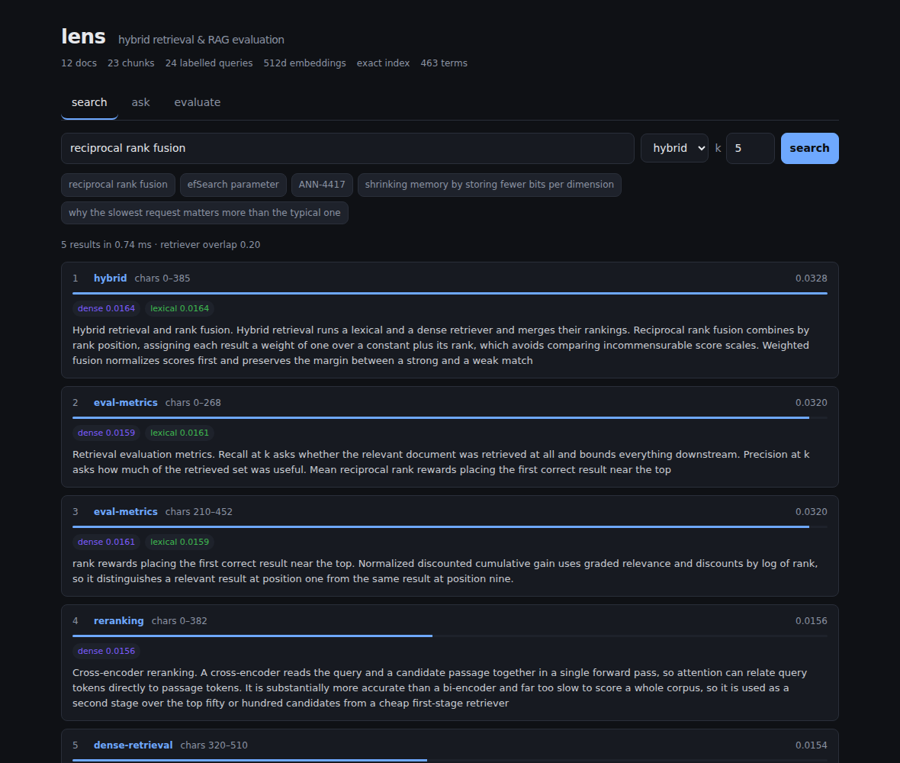
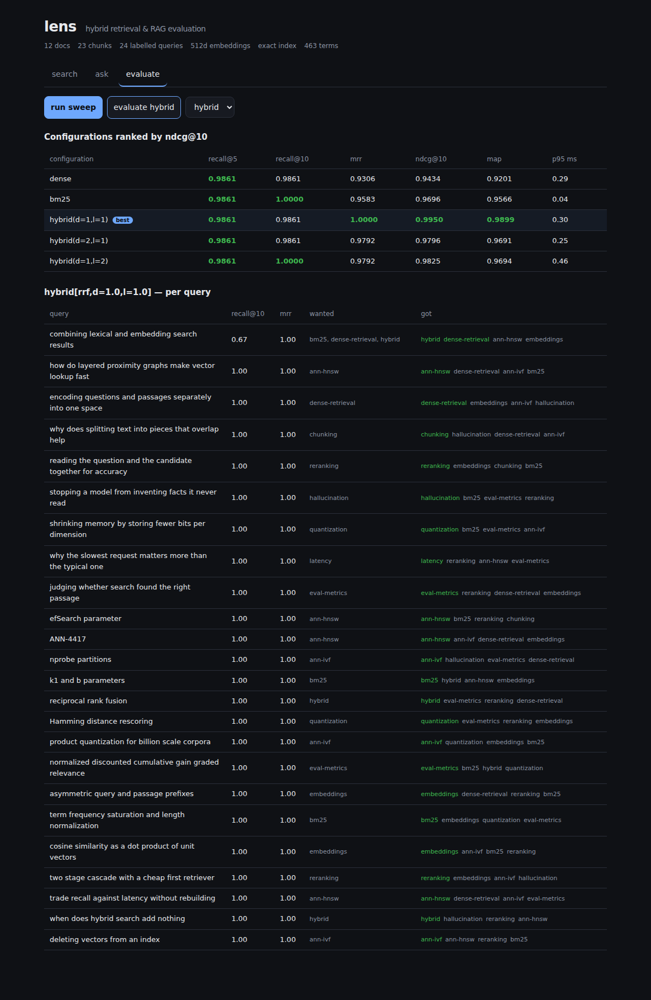

# lens

Hybrid retrieval and RAG evaluation, built from first principles: **HNSW and BM25 implemented from
scratch**, rank fusion, a cited-answer pipeline, and an evaluation harness that runs
**deterministically with no API key and no network**.

```
$ lens sweep
configuration                 recall@5  recall@10        mrr    ndcg@10        map    p95 ms
--------------------------------------------------------------------------------------------
hybrid(chunk=400,d=1,l=1)       0.9861     0.9861     1.0000     0.9950     0.9899      0.28  <- best
hybrid(chunk=200,d=1,l=1)       0.9861     1.0000     0.9792     0.9826     0.9699      0.41
bm25(chunk=800)                 0.9861     1.0000     0.9792     0.9814     0.9659      0.04
dense(chunk=400)                0.9861     0.9861     0.9306     0.9434     0.9201      0.20
dense(chunk=800)                0.9861     0.9861     0.9028     0.9090     0.8854      0.34

spread on ndcg@10: 0.0859 (hybrid(chunk=400,d=1,l=1) over dense(chunk=800), 24 queries)
```

[](https://github.com/Khwahishd/lens/actions/workflows/ci.yml)




---

## Why this exists

Most RAG projects wire a vector database to an LLM API and stop. Two things are then true and
neither is addressed: you cannot say whether the retrieval is any good, and you cannot reproduce
the answer you got yesterday.

This project is built around fixing both.

**Everything is measurable.** The evaluation harness reports recall, precision, MRR, nDCG and MAP at
several cutoffs, with latency percentiles — and keeps *every query's* result, because a mean recall
of 0.8 is equally consistent with "every query is mediocre" and "most are perfect, a few fail
completely", and those need opposite fixes.

**Everything is reproducible.** The default embedder and generator are deterministic and local. The
whole test suite, the harness and CI run with no API key, no network and no cost, producing
identical numbers on every machine. An evaluation harness whose results depend on a remote model's
sampling is not an evaluation harness; it is a weather report.

**Everything is built, not imported.** HNSW, BM25, the fusion ranker and the metrics are implemented
here. numpy is the only runtime dependency.

---

## Architecture

```
  documents
     │  chunking          recursive split on natural boundaries, with overlap
     ▼
   chunks ──────────┬──────────────────┐
     │              │                  │
     │ embed        │ BM25             │
     ▼              ▼                  │
  HNSW graph    inverted index         │
     │              │                  │
     └──── rank fusion (RRF) ──────────┘
                    │
                    ▼
             ranked chunks ──► prompt (budgeted, numbered) ──► answer + citations
                    │
                    └──────────► evaluation harness ──► per-query metrics
```

| Module | What it does |
|---|---|
| `lens.index.hnsw` | HNSW graph index + exact brute-force baseline |
| `lens.index.bm25` | Okapi BM25 with an inverted index and per-term explanation |
| `lens.retrieval` | Dense / lexical / hybrid retrievers and two fusion strategies |
| `lens.chunking` | Recursive and fixed-window chunking with verifiable offsets |
| `lens.providers` | Embedder and generator protocols + deterministic local defaults |
| `lens.pipeline` | Prompt construction, context budgeting, citation extraction |
| `lens.eval` | Metrics, the harness, dataset loading |
| `lens.api` | FastAPI service |
| `web/` | React + TypeScript dashboard |

---

## HNSW, from scratch

Exact nearest-neighbour search over *N* vectors costs *O(N)* distance computations. At a million
chunks and 768 dimensions that is hundreds of millions of multiply-adds per query. Tree structures
degrade to brute force above ~20 dimensions — the curse of dimensionality makes every point nearly
equidistant.

HNSW stacks proximity graphs: the top layer is sparse and long-range, each layer below denser and
more local. Search descends through them. **It is a skip list generalized from one dimension to
many.** Cost drops to roughly *O(log N)*.

Measured against exact search on 4,000 clustered 64-dimensional vectors:

| ef | recall@10 | distance computations/query | vs brute force |
|---|---|---|---|
| 16 | 1.000 | 241 | **16.6× fewer** |
| 64 | 1.000 | 284 | 14.1× fewer |

`ef` is tunable *at query time* — the recall/latency dial moves without rebuilding the index, which
is what makes it operable.

### The heuristic that matters

The neighbour-selection step (Algorithm 4 in the paper) keeps a candidate only if it is closer to
the new node than to any already-selected neighbour. Keeping simply the *M* nearest instead produces
tight, well-connected clusters **with no bridges between them** — and greedy search, which can only
follow edges, gets trapped in the first cluster it enters.

That failure mode is invisible on uniformly random data and severe on clustered data. Real
embeddings are clustered, so [the tests use clustered vectors](tests/test_hnsw.py) deliberately.

### Two performance findings

The index was profiled, not assumed:

- **Vectorizing the right loop.** Batching the neighbour-expansion distances into one matrix-vector
  product (instead of one dot product per edge) sped up queries. Applying the same treatment to
  `_select_neighbours` made the build **57% slower** — that loop has an early exit that almost
  always fires on the first comparison, so batching paid array-construction cost to compute
  distances the early exit never needed. It was reverted; build time went 27s → 17s.
- **Query distribution dominates reported recall.** Queries drawn from outside the data distribution
  scored 0.78 recall@10; in-distribution queries scored 1.000 on the same index. A benchmark that
  does not say which it used is not saying much.

---

## Hybrid retrieval

Dense and lexical retrieval fail in **complementary** ways. Embeddings capture paraphrase
("car" ≈ "automobile") but blur exact tokens; BM25 nails exact terms but misses any rewording.

That premise is [asserted as a test](tests/test_eval.py), not just claimed — the suite fails if the
corpus stops containing queries where each retriever beats the other:

```
q03  "why does splitting text into pieces that overlap help"   dense 1.00  lexical 0.50
q16  "combining lexical and embedding search results"          dense 1.00  lexical 0.50
q24  "deleting vectors from an index"                          dense 0.50  lexical 1.00
```

### Fusing correctly

**Reciprocal rank fusion** combines by *rank*: `weight / (k + rank)`. It needs no calibration, which
is the whole appeal — BM25 scores are unbounded sums of IDF terms while cosine similarities live in
[-1, 1], and they are simply not comparable as numbers. The constant `k = 60` damps the top ranks so
that **agreement across retrievers outweighs confidence within one**, which is the point of fusing.

**Weighted fusion** normalizes scores first, preserving the *margin* between a strong and a weak
match — information RRF discards — at the cost of needing the normalization to stay meaningful.

One subtlety that is easy to get wrong: an item missing from a retriever's list contributes
**nothing** from that retriever, not its minimum score. Treating "not retrieved" as "scored lowest"
systematically penalises items only one retriever surfaced — precisely the items hybrid retrieval
exists to rescue.

---

## Evaluation



| Metric | The question it answers |
|---|---|
| **Recall@k** | Did we find the answer at all? *The ceiling on everything downstream.* |
| **Precision@k** | How much of what we retrieved was useful? *Every irrelevant chunk spends context.* |
| **MRR** | How far down was the first good result? |
| **nDCG@k** | How good is the whole ordering? *The only one using graded relevance.* |
| **Groundedness** | Is the answer traceable to retrieved text, or invented? |

Three decisions in the harness that change the numbers:

- **Queries with no labelled relevant document are skipped, not scored.** Scoring them 0 depresses
  the mean; scoring them 1 inflates it. Both are arbitrary, so they are excluded and counted.
- **nDCG normalizes against the full ideal gain set.** Otherwise a retriever that perfectly orders
  the two relevant documents it found — while missing eight — scores 1.0. [The test pins both
  values](tests/test_metrics.py) so the misleading one stays visible.
- **Latency is reported as percentiles, nearest-rank.** A p50 of 5 ms with a p99 of 400 ms is a
  different system from a uniform 12 ms; the mean makes them identical.

---

## Quick start

```bash
git clone https://github.com/Khwahishd/lens && cd lens
pip install -e ".[api,dev]"

lens search "efSearch parameter"             # ranked chunks, with score attribution
lens ask "what does efSearch control"        # cited answer
lens eval --retriever hybrid                 # metrics + the queries that failed
lens sweep                                   # compare 15 configurations
```

`lens search` shows which retriever contributed what:

```
query: 'efSearch parameter'   (0.38ms, 3 results)
  {"dense_candidates": 9, "lexical_candidates": 2, "fusion": "rrf", "overlap": 0.1}

 1. [0.0328] ann-hnsw  (272-674)
    from: dense=0.0164, lexical=0.0164
    …The parameter efSearch trades recall against latency at query time…
```

### Service and dashboard

```bash
uvicorn lens.api:app --reload      # http://127.0.0.1:8000/docs
cd web && npm install && npm run dev   # http://localhost:5173
```

| Endpoint | |
|---|---|
| `GET /api/search` | ranked chunks with offsets and per-retriever attribution |
| `GET /api/ask` | cited answer; `include_prompt=true` returns the exact prompt sent |
| `GET /api/eval` | aggregate metrics plus every query's outcome and the failures |
| `GET /api/sweep` | all configurations compared, best named |
| `GET /api/status` · `/api/health` | index statistics; liveness separate from readiness |

### As a library

```python
from lens import build_index, HashingEmbedder, RAGPipeline, ExtractiveGenerator
from lens.eval import evaluate_retriever, compare
from lens.eval.datasets import load_jsonl

docs, queries = load_jsonl("data/corpus.jsonl", "data/queries.jsonl")
dense, lexical, hybrid = build_index(docs, HashingEmbedder(dim=512))

print(compare([evaluate_retriever(r, queries) for r in (dense, lexical, hybrid)]))

answer = RAGPipeline(hybrid, ExtractiveGenerator(), k=5).answer("what is reciprocal rank fusion")
print(answer.text)
for c in answer.citations:
    print(f"  {c.chunk.doc_id} chars {c.chunk.start}-{c.chunk.end}")
```

Bring your own dataset as JSONL (the BEIR-style format) and swap in any embedder satisfying the
`Embedder` protocol — OpenAI, Cohere, a local sentence-transformer.

---

## Testing

```bash
pytest          # 197 tests, ~17s, no network
ruff check .
mypy src
cd web && npm run typecheck
```

| Suite | Covers |
|---|---|
| `test_hnsw.py` | Recall ≥0.95 vs exact search, the ef recall/work tradeoff is monotone, layer structure, degree bounds, reproducibility, zero-vector and dimension-mismatch handling |
| `test_bm25.py` | Term-frequency saturation, length normalization responding to `b`, **IDF never going negative** across the full df range, per-term explanation summing to the score |
| `test_chunking.py` | Offsets reproducing source text exactly, overlap never starting mid-word, oversized-token hard cuts, invalid parameters that would loop forever |
| `test_fusion.py` | Consensus beating single-retriever confidence, score scale irrelevance, missing items not scored as minimum |
| `test_metrics.py` | Hand-verified values; the nDCG ideal-gains trap; groundedness catching invention |
| `test_eval.py` | Reproducibility, skip-not-score, **complementary failure of the two retrievers** |
| `test_pipeline.py` | Context budgeting, refusing to truncate a chunk, citation extraction |
| `test_api.py` | Every endpoint, validation errors, best-row consistency |

`filterwarnings = ["error"]`: a `DeprecationWarning` from this project's own code fails the build.

### Four bugs the tests caught

- **The extractive generator quoted its own instructions.** Splitting the prompt at `Question:`
  included the instruction block as "context", and *"If the context does not contain the answer, say
  so"* scores well on term overlap against almost any question. Now the context is the span strictly
  between the `Context:` and `Question:` headers.
- **Chunk overlap started mid-word** (`"ily, and performs a best-first…"`). That fragment is a token
  the embedder has never usefully seen, and it appeared verbatim in generated answers. Overlap
  boundaries now snap forward to a word boundary.
- **Two test premises about my own IDF were wrong.** I asserted a term in every document scores 0.
  Sweeping the full df range showed the Lucene `+1` form decreasing monotonically to 0.087 but never
  reaching zero — it is the `+1`, not the floor I had written, that prevents negativity. The test
  now checks the real property and pins the classic formula's negativity as the contrast.
- **A fixture corpus too easy to test anything.** The inline corpus gave dense retrieval MRR 1.00 on
  every query, so "complementary failure" could not be observed. Fixtures now load the shipped
  dataset, which doubles as a check that `data/` is valid.

---

## Limitations

Stated plainly, because they bound what the numbers above mean:

- **The corpus is 12 documents and 24 queries.** Large enough to exhibit complementary failure and
  to make the harness demonstrable; far too small for the absolute scores to mean anything. Point it
  at BEIR for real numbers.
- **The default embedder is hashed bag-of-words, not a trained model.** It is the *control
  condition*: reproducible, free, and a floor — if a tuned pipeline cannot beat it on your corpus,
  the embedding model is not the problem. Swap in a real one through the `Embedder` protocol.
- **HNSW build is pure Python** (~17s for 4,000 vectors). The graph structure and search are the
  point; a production index would build this in a compiled extension.
- **Groundedness is verbatim-span matching.** It catches an answer invented wholesale, which is the
  failure that matters most, but not a plausible *paraphrase* of something never retrieved.

## What I'd do next

- **Cross-encoder reranking** over the fused top-50. The single largest accuracy gain available, and
  the architecture already has the slot for it.
- **Incremental indexing.** BM25 needs corpus-wide statistics and is rebuilt wholesale; HNSW
  supports insertion but not deletion (which needs tombstones plus periodic compaction).
- **Query-side improvements**: HyDE, multi-query expansion, and learned fusion weights instead of
  the grid sweep.
- **An LLM-judge metric** for semantic answer quality, run as a clearly-separated non-deterministic
  tier so the reproducible core stays reproducible.
- **Quantization.** Scalar quantization is ~4× memory for little recall loss; binary plus
  full-precision rescoring goes further.

## References

- Malkov & Yashunin, [*Efficient and robust approximate nearest neighbor search using HNSW graphs*](https://arxiv.org/abs/1603.09320) (2016)
- Robertson & Zaragoza, [*The Probabilistic Relevance Framework: BM25 and Beyond*](https://www.staff.city.ac.uk/~sbrp622/papers/foundations_bm25_review.pdf) (2009)
- Cormack, Clarke & Buettcher, [*Reciprocal Rank Fusion outperforms Condorcet and individual rank learning methods*](https://plg.uwaterloo.ca/~gvcormac/cormacksigir09-rrf.pdf) (2009)
- Weinberger et al., [*Feature Hashing for Large Scale Multitask Learning*](https://arxiv.org/abs/0902.2206) (2009)
- Thakur et al., [*BEIR: A Heterogeneous Benchmark for Zero-shot Evaluation of IR Models*](https://arxiv.org/abs/2104.08663) (2021)

## License

MIT — see [LICENSE](LICENSE).
